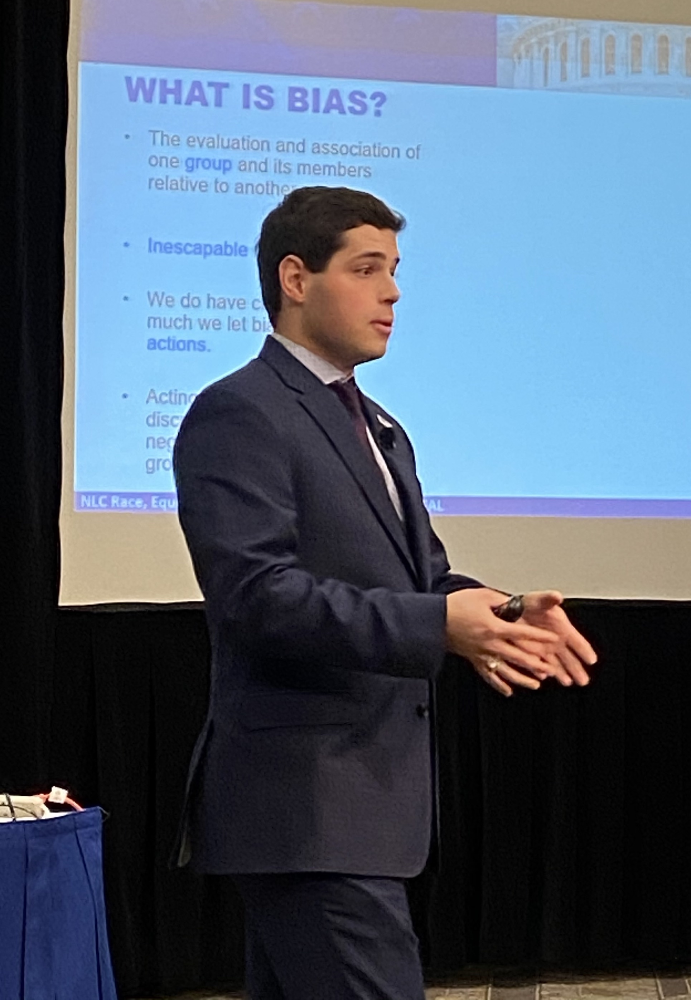

# gis-portfolio
This is my portfolio for 90-753: Advanced GIS, at Carnegie Mellon University's Heinz College. My portfolio lives at https://iansnyder5.github.io/gis-portfolio

# About me

Pronouns: He/Him/His. I'm a second-year MSPPM-DC student at Carnegie Mellon University's Heinz College of Information Systems and Public Policy. I'm originally from the Philadelphia area (Montgomery County, for those with any familiarity). I spent four wonderful years at the University of Pittsburgh, where I graduated with a Bachelor of Arts in Political Science and a Neuroscience Minor (thanks, past life as a pediatric dentist). I came straight to Heinz from Pitt with the hope of honing a quantitative skillset to accompany my qualitative skills from undergrad and using these skills to promote racial equity and anti-racist local government policy. I've worked in Pittsburgh City Council (twice, two different offices), the Borough of Dormont, PA, and as a Mayoral Fellow in the City of Chicago. I'm currently a Heinz Policy Fellow at the National League of Cities' Race, Equity, And Leadership (REAL) initiative, and I plan to move back to Philadelphia and work in City government post-graduation.

# What I hope to learn

I believe that GIS/mapping is one of the most effective tools we, as public policy students and future policymakers, have to translate data and trends to stakeholders, decisionmakers, and the greater public. Health Care GIS, which I took last spring, was an extremely informative and useful course that adequately prepared me to conduct GIS analyses in a workplace setting (ArcMap is another story). However, like other Heinz skill-based courses, I left feeling that I had learned enough GIS to be *adequate* but not exceptional. Because I see myself as more of an intermediary between those who conduct data analysis and those who communicate it, for most other skills I've learned at Heinz (R, Python, Tableau, Access), this is fine. I want to graduate, though, as an "expert" in one skill. I think GIS/mapping is the most important critical for which I could take a deeper dive and attempt to get closer to "expert" status. I hope that Advanced GIS will allow me to sharpen the ArcGIS Pro skills I learned last year while, more imporantly, equipping me with an expanded mapping toolkit that I can use in a workplace (see: local government) that may not (probably does not) have the resources to buy ArcGIS Pro software. The first step toward racial equity is identifying racial inequities through data, and I can make a more substantial contribution to ensure racial equity and anti-racist local policy by visualizing and communicating these disparities through maps.

# Portfolio.

## [Lab: Github](/labgithub.md)

## [Assignment: Create a custom Google Maps style from an image](/assignmentgooglemapsstyle.md)

## [Assignment: Create a custom ArcGIS map style](/assignmentarcgismapstyle.md)

## [Assignment: Building an online map from scratch using Mapbox](/assignmentmapbox.md)

## [Assignment: Using ArcGIS Insights to investigate the DEA's pain pill database](/assignmentarcgisinsights.md)

## [Assignment: Creating your own geographic footprint](/assignmentgeographicfootprint.md)
