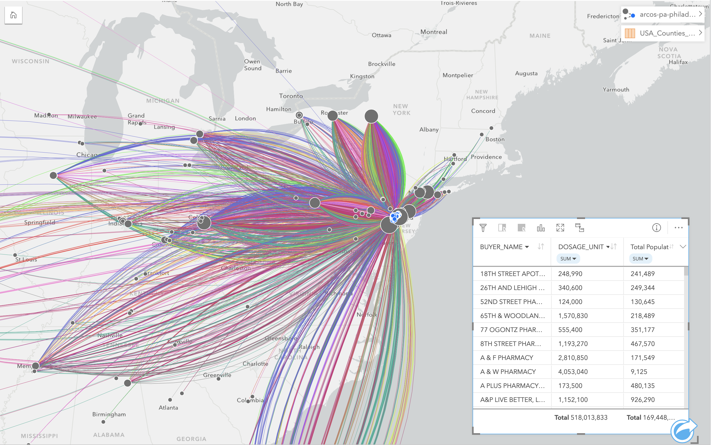

# Assignment: Using ArcGIS Insights to investigate the DEA's pain pill database

## What did you learn from working with these data and performing this analysis?

From working with these data and performing this analysis, I learned just how pervasive the pharmaceutical industry's reach and impact on the opioid crisis are. I think the project reinforced how important good journalism is, too. These data, and the DEA's database, would not be available for us to use had it not been for the persistence of The Washington Post. I had no idea how many drug distributors ship to a given county - and multiple pharmacies in that county, no less. Philadelphia was supplied 518,013,833 pain pills from 2006 to 2014, which is staggering. That's 38 per resident *per year*. I had no idea the prescription painkiller problem was *this* bad. With these data and the power to illustrate the severity of the opioid problem in any given county, I feel empowered to bring this tool (mapping, at the very least) to wherever I work post-graduation.

## Under what circumstances (or for what types of users) would you recommend using ArcGIS Insights?

I would recommend ArcGIS Insights for any user who wants to visualize maps and map trends for a wider audience. To me, it appears to be a more intuitive software than ArcGIS Pro (for displaying data via layouts, that is). More importantly, it is a far more powerful mapping software than Tableau, which is limited in its mapping capabilities. I believe that mapping is a key tool for helping the public understand data and data trends. ArcGIS Insights has the potential to be the frontrunner, at least for me, in dissecting and disseminating data for those impacted by the data and who have the power to act on the data.

## Can you imagine a scenario where tools like ArcGIS Insights might be preferable or a compliment to ArcGIS Pro?

From a practical standpoint, as a Mac user, I love the fact that ArcGIS Insights is native to macOS. I have to run a virtual PC desktop to use ArcGIS Pro, which is cumbersome and slow. I think ArcGIS Insights is preferable to ArcGIS Pro for presenting data to stakeholders or another external audience. ArcGIS Pro is preferable for conducting heavier data analysis and manipulation, especially its raster and network features. Unfortunately, The difference in price (ArcGIS Pro is *much* cheaper) may make the deicison for many organizations, especially public/government entities and non-profits.
