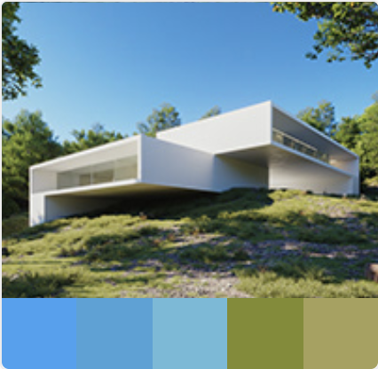
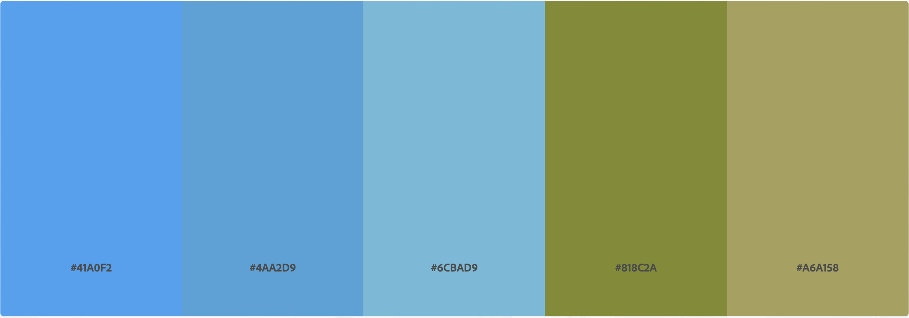

# Assignment: Create a custom ArcGIS map style

**Final Product: https://arcg.is/TSuXe**

## Source and Inspiration

I took a loose interpretation to what "inspires" me for this assignment (and for the stake of staying within copyright-free imagery). Using the prescribed "Adobe Color Trends" website, I found an image that contained two things that inspire me - architecture and nature - and combined them masterfully. The image, which I do not own, can be found [here.](https://www.behance.net/gallery/90619697/House-in-Rio-de-Janeiro?tracking_source=curated_galleries_list)

For clarity, I've isolated the color palette that Adobe pulled from this image below:

I started with the "Colored Pencil" basemap style, as I wanted a map that found a balance between fun and usability, especially for natural features and parks. Like with the Google Maps style assignment, incorporating the colors into the map features in the pre-set order (left-to-right for Land, Water, Roads, Boundaries, Buildings, respectively) did not create an intuitive map. Land, water, and road, which are the most relevant features, were all shades of blue, which prevented a clear distinction between them. In addition, the five-step color ramp did not account for nature, the sixth necessary feature. From an intuition standpoint, it made sense to make Land one of the shades of green from the palette and to ensure that Roads would not be confused for rivers or other waterways if left as blue. Therefore, I switched Land to the darker shade of green, Nature to the lighter shade of green, and Roads to the original pre-set color for Nature (#f1f1bc). This final configuration struck the best balance between using the inspiration image's colors and usability.

## ArcGIS map style vs. Google Maps style

[Link to Assignment: Create a custom Google Maps style from an image](https://iansnyder5.github.io/gis-portfolio/google_map_style_philly.html)

Though I appreciate the added data capabilites of ArcGIS and being able to add branding or other styles for in-depth stakeholder analyses, I prefer the Google Maps style maker. Google Maps is an *extremely* familiar interface for many users, whereas ArcGIS, while still intuitive, is less familiar. Being able to stylize a Google Map, with its built-in points of interest, features, and lack of user cost, is a more powerful tool, in my opinion. When I use ArcGIS, I go for function over form - i.e. What's going to make this map useful for data analysis. I don't want to dress it up the same way I would for a Google Map, which I would use for a less data-intensive purpose. Though I created a map that attempts to find a balance between approachability and utility, the map still involves a public stakeholder interpreting a new system of data visualization. ArcGIS also requires the organization creating the map to pay for the software, which is out of reach for many governments and non-profits.

## Check Quality Using Map Scales

As I stated, the first glaring quality check I did showed that Roads, which started as a shade of blue, could be confused for rivers and other waterways. Even at a large scale, it was obvious that I should fix this to make it more intuitive. Once I finalized the color-feature match that made the most sense, I adjusted the map at 4 scales: "2," "5," "9," and "14" (image above). The maps at both scales 2 and 5 showed that the Land/Boundary contrast works. Zooming in to scale 6 displays the better Road color and the clarity of contrast between Roads and Land. Scale 14 shows the full contrast of every major feature, including the subtle, but useful, contrast in color *and* texture between Land and Nature.
