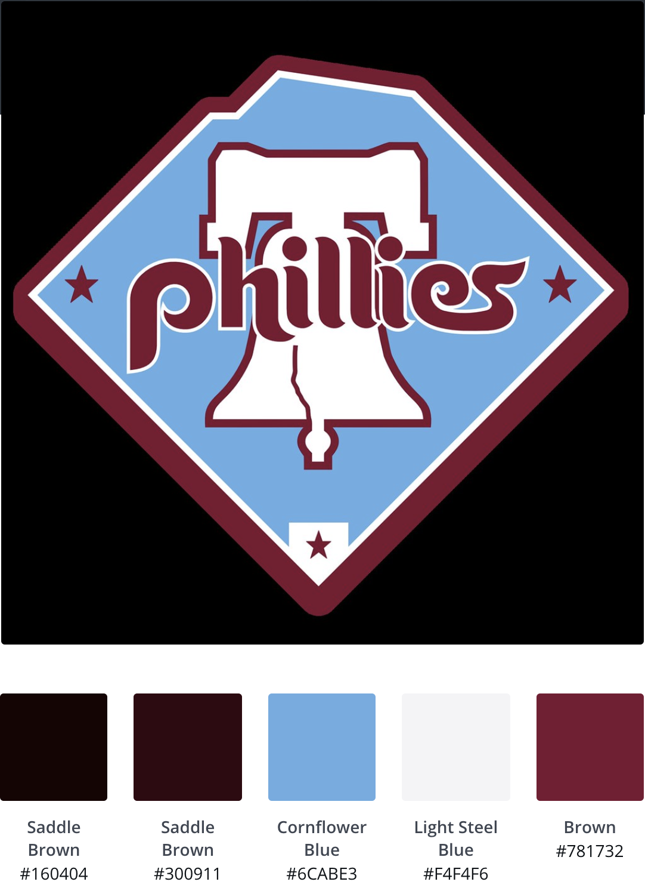

# Lab: Create a custom Google Maps style from an image

Final product: https://iansnyder5.github.io/isnyder-portfolio/google_map_style_philly.html

## Part I

For this lab, I wanted to color-coat Philadelphia in colors that showcase the city's pride. I originally thought to use a public image of the City of Philadelphia [flag](https://www.google.com/url?sa=i&url=https%3A%2F%2Fcommons.wikimedia.org%2Fwiki%2FFile%3AFlag_of_Philadelphia%2C_Pennsylvania.svg&psig=AOvVaw1G4uqklXZ5TZ5j3cxXksAC&ust=1584990411875000&source=images&cd=vfe&ved=0CAIQjRxqFwoTCJCT58XjrugCFQAAAAAdAAAAABAD), but the color palette picked up on too many of the detail colors from the crest in the middle. Because I'm an avid Phillies fan, I then thought to use a public image of the basic Phillies [logo](https://www.google.com/url?sa=i&url=https%3A%2F%2Fen.wikipedia.org%2Fwiki%2FFile%3APhiladelphia_Phillies_Insignia.svg&psig=AOvVaw292-JEWARJusNaWBMZbpHF&ust=1584990497153000&source=images&cd=vfe&ved=0CAIQjRxqFwoTCPC8p-7jrugCFQAAAAAdAAAAABAD), instead. However, the color scale centered on white, which I thought would not make for an interesting map base. My third attempt involved a public image of an [older Phillies logo](https://www.google.com/url?sa=i&url=https%3A%2F%2Fwww.flickr.com%2Fphotos%2Fmelling2293%2F6171367700&psig=AOvVaw292-JEWARJusNaWBMZbpHF&ust=1584990497153000&source=images&cd=vfe&ved=0CAIQjRxqFwoTCPC8p-7jrugCFQAAAAAdAAAAABAH), which used universally-beloved "throwback" colors. The white background of this image produced the same problem I had with the first Phillies logo. Thankfully, there was another public version of the image with a black background, which allowed me to center on "Cornflower Blue" and was my eventual inspiration for the color palette (below):

Originally, I followed the methodology and sequencing of assigning colors from the palette verbatim from the example provided. This meant that, based on my color palette, I assigned the streets the "Light Steel Blue" color.

While this looked neat, the featured colors of the palette I selected are really the Cornflower Blue and "Brown," which is more commonly referred to as a "maroon." In the original version, only the names of parks featured the "Brown" color prominently. I made some tweaks to feature "Brown" as the street color so the map would highlight "Cornflower Blue" and "Brown" foremost.

## Part II

I've never created an API before, so Part II was daunting to me, at the start. The main issue I had, though, was that the . (period) that Google recommended for API restrictions before the web address was unnecessary. After troubleshooting and removing that, I found the process rather straightforward.

Continuing on the theme of Philly pride, I created 3 layers of "Philly Must-Haves" point features using Google MyMaps: "Wawa," "Cheesesteak," and "Soft Pretzel." Though all three groups are featured on the final lab (link above), they exported as a single entity in the KML file and all appear as white markers in the final map. To see the three layers individually through Google MyMaps, click [here](https://drive.google.com/open?id=1eu_47bS8iQjbzsqGd8PTZiv_Nio2Urca&usp=sharing).

__Takeaway: I didn't know *anything* we just did existed before this Lab, and I'm excited to have an easy-to-use skill to add to my toolbox after the first week!__
